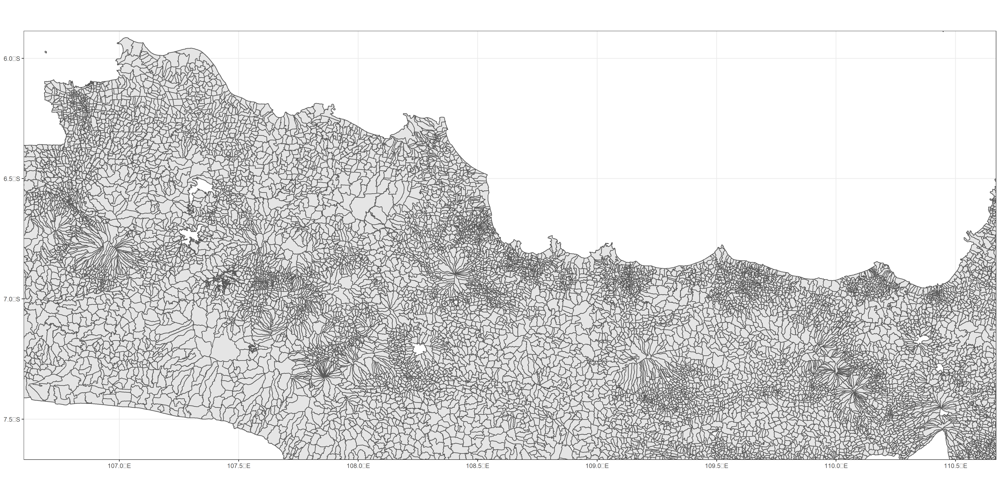
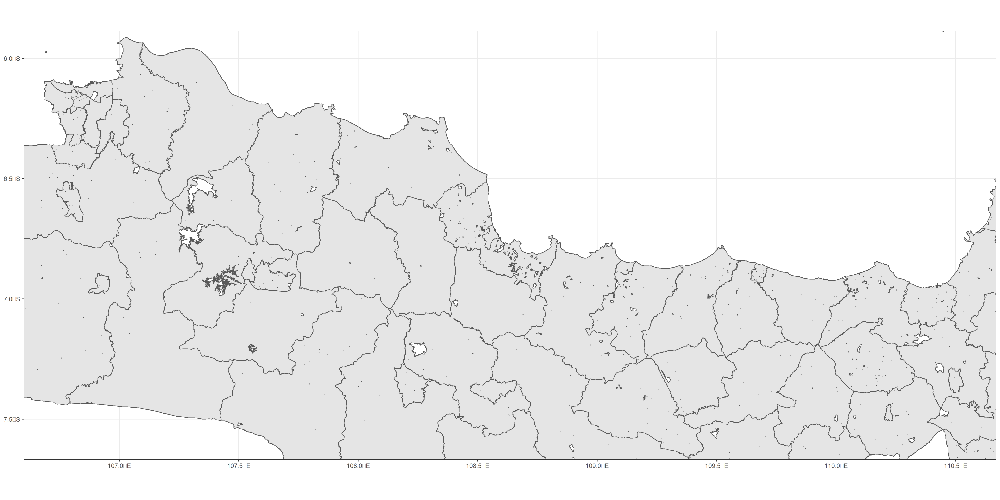
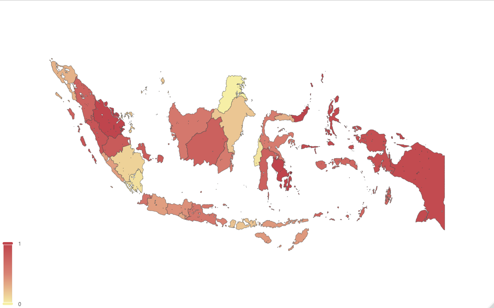

# Indonesia geojson shp

## Indonesia geojson and shape file
The maps here contains several levels administrative borders:
- Village (Desa/Kelurahan)
- Sub District (Kecamatan)
- District (Kota/Kabupaten)
- Province (Propinsi)

There are two versions: detail and simplified. You can download them zipped on the release page.

## Peta wilayah Indonesia dalam format geojson dan .shp file
Peta ini terdiri atas beberapa tingkat wilayah:
- Desa / Kelurahan (village)
- Kecamatan (Sub-district)
- Kota / Kabupate (District)
- Propinsi (Province)

Ada dua tipe peta yang dapat kalian unduh: versi detail dan versi sederhana. 
Kalian dapat mengunduh baik data lengkap yang ter-zip di halaman release.

Information table

| Level | Tingkat | Rows | GeoJson Size | SHP Size |  GeoJson Simple | SHP Simple |
| :---- | :------ | ---: | -----------: | -------: | -----------: | -------: |
| Village | Desa | 83322 | ~231 MB | ~287 MB | ~32 MB | ~52 MB |
| Sub-District | Kecamatan | 7187 | ~84 MB | ~116 MB | ~3.8 MB | 4.7 MB |
| District | Kota/Kabupaten | 514 | ~38 MB | ~53 MB | 0.9 MB | 0.75 MB |
| Province | Propinsi | 34 | ~21 MB | ~30 MB | 0.4 MB | 0.3 MB |

### code and plot sample

```r
library(geojsonio)
library(sf)
library(tidyverse)

sf::sf_use_s2(FALSE)

indonesia_shp <- read_sf("geojson_shp_desa/indonesia_village.geojson", type = 4)

jawa_shp <- indonesia_shp %>% filter(province == "DKI JAKARTA" | province == "JAWA BARAT" | province == "JAWA TENGAH")

plot_village = ggplot(jawa_shp, aes(geometry = geometry, label = village)) + 
  geom_sf() + 
  coord_sf(ylim = c( -7.5873038, -5.9673038), xlim = c(106.7848745, 110.4848745)) +
  theme_bw()

ggsave(filename = "plot_samples/images/indonesia_village.png", plot = plot_village, width = 20, height = 10, units = "in", dpi = 300)
```




```r
library(geojsonio)
library(sf)
library(tidyverse)

sf::sf_use_s2(FALSE)

indonesia_kabupaten_shp <- read_sf("geojson_shp_kota_kabupaten/indonesia_kabupaten.geojson", type = 4)

jawa_shp <- indonesia_kabupaten_shp %>% filter(province == "DKI JAKARTA" | province == "JAWA BARAT" | province == "JAWA TENGAH")

plot_district = ggplot(jawa_shp, aes(geometry = geometry, label = district)) + 
  geom_sf() + 
  coord_sf(ylim = c( -7.5873038, -5.9673038), xlim = c(106.7848745, 110.4848745)) +
  theme_bw()

ggsave(filename = "plot_samples/images/indonesia_kabupaten.png", plot = plot_district, width = 20, height = 10, units = "in", dpi = 300)

```



```r
library(jsonlite)
library(echarts4r)

json_propinsi <- jsonlite::read_json("https://github.com/feiferry/indonesia_geojson/raw/main/geojson_shp_provinsi/indonesia_province.geojson")
indonesia_propinsi_data <- read.csv("plot_samples/R/data_propinsi.csv")

indonesia_propinsi_data |>
  e_charts(province) |>
  e_map_register("propinsi_indonesia", json_propinsi) |>
  e_map(value, map = "propinsi_indonesia") |> 
  e_visual_map(value)
```

